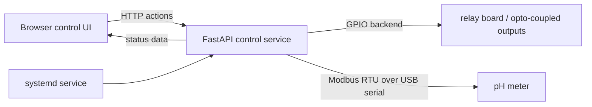

# Pi Control Program

Local web dashboard for Raspberry Pi / Jetson edge-device control. The app exposes a small browser UI for operating GPIO-driven relay outputs, pumps, valves, lift controls, heater control, simulated tank telemetry, and optional Modbus RTU pH-meter input.

This project is a compact example of practical edge automation: a simple operator interface, backend control logic, hardware abstraction, deployment automation, and local development fallback when real GPIO hardware is not available.

## Highlights

- Minimal local web UI for switching relay-controlled devices on and off
- GPIO backend support for Raspberry Pi and Jetson-style runtimes
- Pump, valve, heater, and lift-control workflow examples
- Configurable tank levels, temperatures, and pH values for UI/testing scenarios
- Optional pH meter polling over Modbus RTU through USB/serial adapters
- systemd + Makefile automation for install, reinstall, status checks, logs, and service management
- Mock GPIO mode for development on non-Pi machines

## Architecture



## Tech Stack

- Python / FastAPI application service
- GPIO backends for Raspberry Pi, Jetson, or mock local development
- Modbus RTU serial integration for pH-meter polling
- systemd deployment automation
- Makefile-based install and maintenance commands

## Quick Start

```bash
python3 -m venv .venv
source .venv/bin/activate
pip install -r requirements.txt

# Optional configuration
export RELAY_PINS=27,22,23
export RELAY_ACTIVE_LOW=1
export TANK_LEVELS=72,58,46
export TANK_TEMPS=32.5,22.0,45.0
export TANK_PHS=6.8,7.2,6.5
export HEATER_GPIO=5

uvicorn app:app --host 0.0.0.0 --port 8000
```

Open `http://<device-ip>:8000` from a browser on the same network.

## Configuration

Common runtime settings:

- `RELAY_PINS` - comma-separated relay GPIO pins
- `RELAY_ACTIVE_LOW` - set to `1` for low-level relay trigger boards, `0` for high-level trigger boards
- `TANK_LEVELS` - soak/fresh/heat water level percentages
- `TANK_TEMPS` - soak/fresh/heat water temperatures
- `TANK_PHS` - soak/fresh/heat pH values
- `GPIO_BACKEND` - `auto`, `jetson`, `rpigpio`, or `gpiozero`
- `PIN_MODE` - `BOARD` or `BCM` where supported
- `GPIOZERO_PIN_FACTORY` - `lgpio`, `rpi`, or `mock`

pH meter settings:

- `PH_METER_ENABLED` - enable or disable Modbus polling
- `PH_METER_PORT` - serial port, for example `/dev/ttyUSB0`
- `PH_METER_ADDR` - Modbus slave address
- `PH_METER_BAUD` - serial baud rate
- `PH_METER_TIMEOUT` - serial timeout
- `PH_POLL_INTERVAL` - polling interval in seconds
- `PH_STALE_SEC` - stale-data threshold

## Deployment

Install and start the service:

```bash
make install SERVICE_USER=pi WORKDIR=/home/pi/pi-control-program RELAY_ACTIVE_LOW=1 PIN_FACTORY=lgpio
```

Maintenance commands:

```bash
make status
make logs
make reinstall
make uninstall
```

## Hardware Notes

- Raspberry Pi deployments can use either BOARD or BCM numbering, depending on the configured backend.
- Jetson GPIO outputs are typically 3.3V only. If a relay board expects a 5V control signal, use a level shifter, transistor driver, or a 3.3V-compatible relay input.
- For remote access, use a private VPN such as Tailscale or ZeroTier and keep the UI on the local/VPN network.

## Local Development Without GPIO Hardware

For development on a regular workstation, use the mock pin factory:

```bash
export GPIOZERO_PIN_FACTORY=mock
uvicorn app:app --host 127.0.0.1 --port 8000
```

## Portfolio Notes

This project demonstrates:

- Building small but complete operational tools for non-desktop hardware environments
- Translating device-control requirements into a browser-accessible operator workflow
- Keeping deployment repeatable through systemd and Makefile automation
- Designing a simple hardware abstraction so the same app can run on real devices or in mock mode